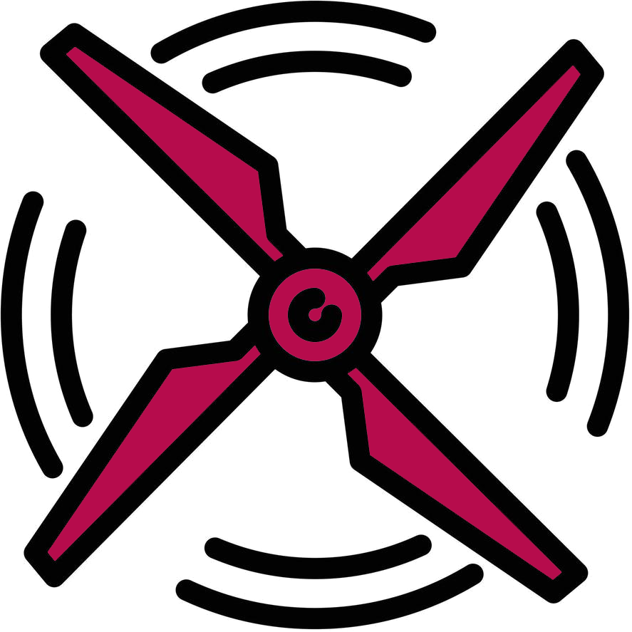

 <h1>Aerial webOS screensaver (fork of <a href="https://github.com/webosbrew/custom-screensaver">custom-screensaver</a>)</h1>
   

* 180+ aerial videos from different sources.
* 40+ locales for OSD
* Source type selection (FullHD/4k SDR or Dolby Vision)
* Requires root and [Homebrew channel](https://github.com/webosbrew/webos-homebrew-channel) 
* Compatible with webOS 5 (2020), webOS 6 (2021), webOS 22 (2022), webOS 23 (2022) 

Disclaimer
---------------
- App replaces original webOS screensaver. Use at your own risk. 

Features
--------

* Autostart registration
* Temporary apply
* Launch screensaver immediately for testing

Installation
------------
This should be downloadable in Homebrew Channel. Otherwise, there's an `ipk` in
GitHub releases to the right. You are on your own here.

Donate
------------
Looking for more sources or cool new features? Any support would mean the world!
* [Boosty](https://boosty.to/aabytt)
* [YooMoney](https://yoomoney.ru/to/4100115685800097)

Screenshots
------------
   
   
   
